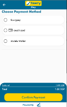
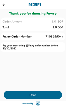
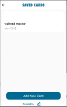
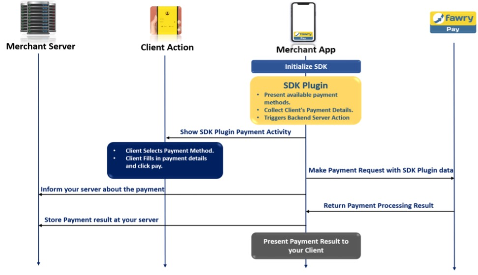
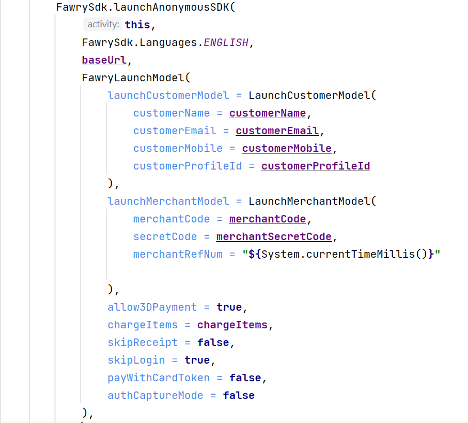
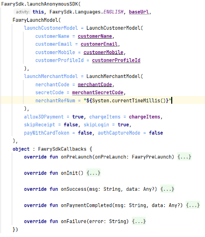
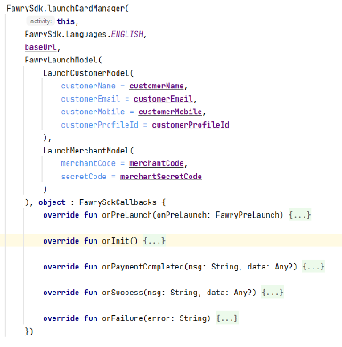
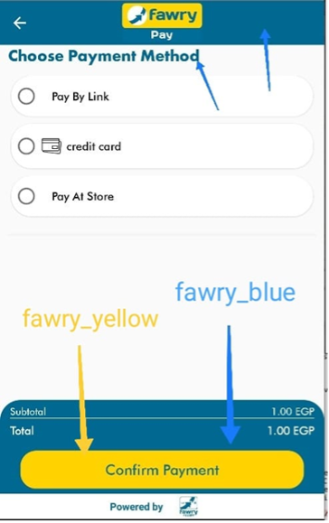
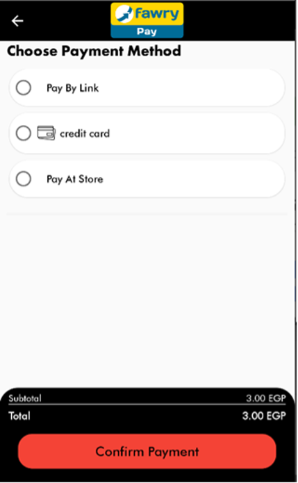

# 

# **FawryPay android SDK**

Accept popular payment methods with a single client-side implementation.

# **Before You Start**

Use this integration if you want your android application to

-   Accept cards and other payment methods.
-   Saves and displays cards for reuse.

Make sure you have an active FawryPay account or [**create an account**](https://atfawry.fawrystaging.com/merchant/register).

## **How Android SDK Looks Like**

  

[**Download**](https://github.com/FawryPay/Android-Fawrypay-Anonymous-sample) and test our sample application.

## **How it works**



On this page we will walk you through Android SDK integration steps:

1.  Installing **FawryPaySDK**.
2.  Initialize and Configure **FawryPay** Android SDK.
3.  Override the SDK colors.
4.  Present Payment options.
5.  Return payment processing information and inform your client of the payment result.

# **Step 1: Installing FawryPaySDK**

This document illustrates how our gateway can be integrated within your android application in simple and easy steps. Please follow the steps in order to integrate the FawryPay android SDK in your application.

1.  Add the following repository to your (root) <code>build.gradle</code><br/> 
``` groovy
repositories 
{ 
  ...
  jcenter() 
  maven { url 'https://nexus.mobile.fawry.io/repository/maven-releases/' } 
}
```
2.  And add the following to your (app) <code>build.gradle</code> and make sure you are using our [Latest Version](https://github.com/FawryPay/Android-Fawrypay-Anonymous-sample/tags) <br/> 
``` groovy 
dependencies 
{ 
  ... 
  implementation 'com.fawry.fawrypay:sdk:0.1.36' 
} 
```

3.  Add the following to your <code>Manifest.xml</code><br/> 
``` groovy 
\<application ... tools:replace="android:allowBackup" /\>
```

4.  Finally add the following property to your <code>build.properties</code><br/> 
```
android.enableJetifier=true
```

# **Step 2: Initialize FawryPay Android SDK**

1.  Create an instance of
2.  LaunchCustomerModel
3.  LaunchMerchantModel
4.  ChargeItemsParamsModel
5.  FawryLaunchModel

and pass the required parameters (Required and optional parameters are determined below).



<br/>LaunchCustomerModel

| **PARAMETER**     | **TYPE** | **REQUIRED** | **DESCRIPTION**                                 | **EXAMPLE**                                        |
|---------------|---------------|---------------|---------------|---------------|
| customerName      | String   | optional     | \-                                              | Name Name                                          |
| customerEmail     | String   | optional     | \-                                              | [email\@email.com](mailto:email@email.com){.email} |
| customerMobile    | String   | optional     | \-                                              | +0100000000                                        |
| customerProfileId | String   | optional     | mandatory in case of payments using saved cards | 1234                                               |

<br/>LaunchMerchantModel

| **PARAMETER**  | **TYPE** | **REQUIRED**        | **DESCRIPTION**                                                           | **EXAMPLE**           |
|---------------|---------------|---------------|---------------|---------------|
| merchantCode   | String   | required            | Merchant ID provided during FawryPay account setup.                       | +/IPO2sghiethhN6tMC== |
| merchantRefNum | String   | required            | Merchant's transaction reference number is random 10 alphanumeric digits. | A1YU7MKI09            |
| secretCode     | String   | required            | provided by support                                                       | 4b8jw3j2-8gjhfrc-4wc4-scde-453dek3d |

<br/>ChargeItemsParamsModel

| **PARAMETER** | **TYPE** | **REQUIRED** | **DESCRIPTION** | **EXAMPLE**         |
|---------------|---------------|---------------|---------------|---------------|
| itemId        | String   | required     | \-              | 3w8io               |
| description   | String   | optional     | \-              | This is description |
| price         | String   | required     | \-              | 200.00              |
| quantity      | String   | required     | \-              | 1                   |

<br/>FawryLaunchModel

| **PARAMETER**           | **TYPE**   | **REQUIRED** | **DESCRIPTION** | **EXAMPLE** |
|---------------|---------------|---------------|---------------|---------------|
| **launchCustomerModel** | LaunchCustomerModel | optional | Customer information.         | \-          |
| **launchMerchantModel** | LaunchMerchantModel | required | Merchant information.         | \-          |
| **chargeItems**         | [ChargeItemsParamsModel]      | required       | Array of items which the user will buy, this array must be of type ChargeItemsParamsModel  | \-          |
| signature               | String    | optional  | You can create your own signature by concatenate the following elements on the same order and hash the result using **SHA-256** as explained:"merchantCode + merchantRefNum + customerProfileId (if exists, otherwise insert"") + itemId + quantity + Price (in tow decimal format like '10.00') + Secure hash keyIn case of the order contains multiple items the list will be **sorted** by itemId and concatenated one by one for example itemId1+ Item1quantity + Item1price + itemId2 + Item2quantity + Item2price | \-          | 
| allowVoucher            | Boolean  | optional - default value = false  | True if your account supports voucher code | \-          |
| payWithCardToken        | Boolean   | required   | If true, the user will pay with a card token ( one of the saved cards or add new card to be saved )If false, the user will pay with card details without saving | \-   | 
| allow3DPayment          | Boolean                 | optional - default value = false | to allow 3D secure payment make it "true" | \-    |
| skipReceipt             | Boolean                 | optional - default value = false      | to skip receipt after payment trial      | \-          |
| skipLogin               | Boolean                          | optional - default value = true  | to skip login screen in which we take email and mobile   | \-          |
| authCaptureMode         | Boolean                          | optional - default value = false                                                                                                                                | depends on refund configuration: will be true when refund is enabled and false when refund is disabled                                                                                             | false       |
| paymentMethod        | Payment_Method           | Optional - default value = .all  | If the user needs to show only one payment method. |.all.payAtFawry.card.wallet |

**Notes:**

-   **you can pass either signature or secureKey (in this case we will create the signature internally), knowing that if the 2 parameters are passed the secureKey will be ignored and the signature will be used.**

## Calling Modes:

1.  Payment Mode: Call launchAnonymousSDK from FawrySdk.launchAnonymousSDK



| **PARAMETER** | **TYPE**      | **REQUIRED**  | **DESCRIPTION** | **EXAMPLE** |
|---------------|---------------|---------------|---------------|---------------|
| activity           | Activity     | required | The activity which will be the starting point of the SDK.  | \-          |
| \_fawryLaunchModel | FawryLaunchModel | required | Has info that needed to launch the SDK | Example in step 3 |                                       
| \_baseUrl          | String       | required | Provided by the support team.Use staging URL for testing and switch for production to go live. | https://atfawry.fawrystaging.com (staging) <br/><br/> https://atfawry.com (production) |     
| \_languages        |  String | required | SDK language which will affect SDK's interface languages. | FawrySdk.Languages.ENGLISH  |      

2.  Card Manager Mode: Call launchCardManager from the shared instance of FawrySdkand the card manager screen will launch.



# **Step 3: Override the SDK colors**

If you want to change colors:

You need to know the id of the color you want to change then add a color in your colors file in the host app with the same id but with the value you want



If you changed these colors it will change the main screen color in the payment fragment I made it black and red as an example in the host app, but you can change it to whatever you want.

For example: the blue color

``` xml
< color name** ="fawry_blue" >#FF000000</ color**>

< color** name ****="fawry_yellow">#F44336</ color** >
```



## 

## **Payment Flows:**

We have 2 payment flows:

1.  Payment with card details, in which we take the card details (card number, cvv, expiry date) in the payment screen and then we handle the payment.
2.  Payment with card token, in which we have 2 screens, first one manages cards which includes (add, delete, retrieve) for cards and the cards are saved and connected to the customerProfileId parameter that you pass in the initialization. And the second screen is the normal payment screen.

To choose which flow you want to start with there is a paymentWithCardToken flag in the initialization of the FawryLaunchModel.

So if this flag is true you will need to pass customerProfileId to be able to complete a payment with its corresponding cards and if the customerProfileId doesn't have saved cards, when the user choose to pay with credit card we would ask him to click a button to show him the card details bottomsheet with a button to choose either to save card or make the payment without saving the card. And in case the user wanted to delete or check which cards he saved or add a new card without opening the payment screen he can start the flow called launchCardManager as determined in step 2.

## Callbacks Explanation:

1.  launchAnonymousSDK:\
    \
    There are 5 callbacks:
    1.  onInit() { }\
        called before launching the flow successfully.

    2.  onPreLaunch(onPreLaunch: FawryPreLaunch) {onPreLaunch.onContinue() }\
        called when the flow is launched.

    3.  onFailure(error: String) { }

        -   if you enabled the receipt, this callback will be called after clicking the done button in the receipt and the payment failed.

        -   if you disabled the receipt, this callback will be called upon the finish of the payment screen and the payment failed.

    4.  onPaymentCompleted(msg: String, data: Any?){}\
        will be called only whether the payment passed or not. And it's called upon receiving the response of the payment either success or fail.

    5.  onSuccess(msg: String, data: Any?){}

        -   if you enabled the receipt, this callback will be called after clicking the done button in the receipt and the payment success.

        -   if you disabled the receipt, this callback will be called upon the finish of the payment screen and the payment success.
2.  launchCardManager:\
    \
    There are 3 callbacks:
    1.  onInit() { }\
        called before launching the flow successfully.

    2.  onPreLaunch(onPreLaunch: FawryPreLaunch) {onPreLaunch.onContinue() }\
        called when the flow is launched.

    3.  onFailure(error: String) { }\
        called in case of failure in the initialization of the flow.

    4.  onPaymentCompleted(msg: String, data: Any?){}\
        not used in this flow.

    5.  onSuccess(msg: String, data: Any?){}\
        not used in this flow.
